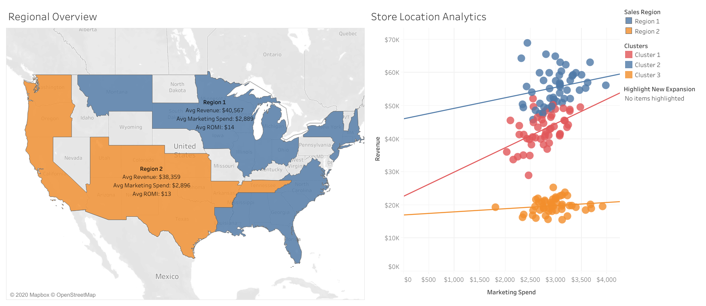
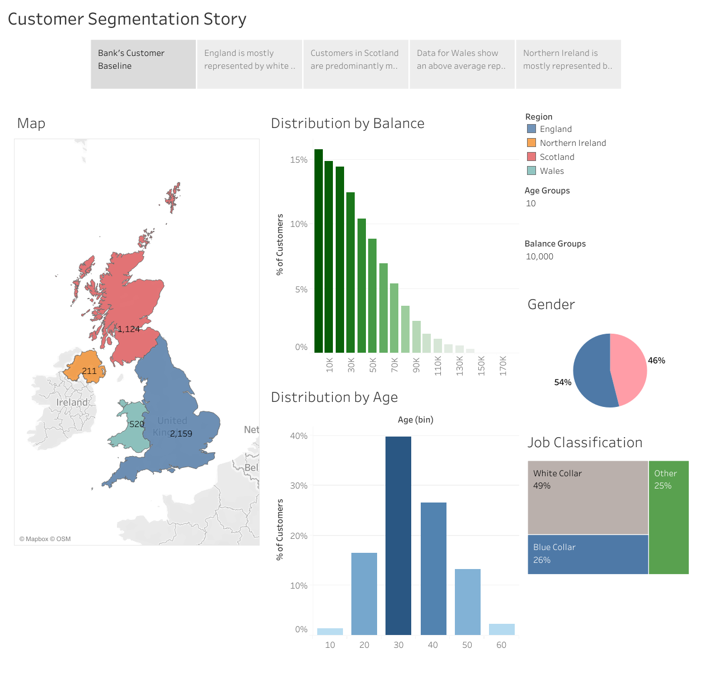

# Tableau Visualisations

This repo contains visualisations of some Tableau exercises that I completed as part of an Udemy course, "Tableau 2020 A-Z: Hands-On Tableau Training for Data Science", to further improve my data analysis and visualisation skills. In addition to displaying data in various outputs, I also used Tableau for analytics, such as for regression analysis with K-means clustering.

Each exercise is explained below followed by the analysis derived from the data visualisation.

## Exercise 1
**Request:**

There is a laundry-pickup services startup that cannot compete with the big players in the major cities, so their strategy is to build a vast network in the smaller cities. They already have a strong presence in 140 locations and recently opened stores in 10 new cities. Additionally, the company has two separate sales regions. They have two analytical tasks that would help them with their expansion plan:

1. Identify which of the two sales regions is performing better (outperforms the other in 2 of the 3 metrics):
   - Average revenue per city
   - Average marketing spend per city (less is better)
   - Average ROMI per city (revenue / marketing spend)
2. Identify which of the 10 new locations have the best potential for the company to invest more funds into marketing

**Provided data:**

To undertake this task, the [Startup_Expansion.xlsx](Startup_Expansion.xlsx) and [US_Cities_Population.csv](US_Cities_Population.csv) files were provided.

**Analysis and Visualisation:**

A screenshot of the data visualisation dashboard in Tableau is shown below and the interactive dashboard can be found at [Tableau Public](https://public.tableau.com/views/StartupExpansionAnalysis_15969757389030/StartupExpansionAnalysis?:language=en&:retry=yes&:display_count=y&:origin=viz_share_link). 

**Task 1 -** The metrics requested are shown on the left map for each region. From these, it is clear that Region 1 has higher average revenue and slightly lower marketing spend per city, and thus, higher average ROMI. Therefore, Sales Region 1 is performing better based on these metrics.

**Task 2 -** Each store location is plotted on the right chart according to its revenue and marketing spend to see if a performance trend (in terms of ROMI) between locations could be identified. Tableau's K-means clustering was used to segregate the data. This split the data points into two groups: blue and orange points as shown in the chart and the red points were largely in the blue group with some in the orange group. 

Since this startup provided laundry-pickup services, one factor that could influence revenue and marketing spend was the city population, as the higher the population, the more customers and so more revenue that could be generated. Therefore, further analysis was undertaken in the form of adding city population as another dimension to the clustering algorithm, which led to three clusters as shown in the chart. 

Linear regression was applied to each cluster and found that stores in Cluster 1 had the highest revenue growth per marketing spend (steepest line), Cluster 2 had the highest overall revenue but didn't grow as fast per marketing spend as Cluster 1, and Cluster 3 had the lowest revenue growth per marketing spend, in fact for each marketing dollar spent, revenue would grow by less than a dollar, so the startup would lose money by spending more money on marketing.

These clusters made sense in terms of population as well. The lowest populated cities were in Cluster 3 so increasing marketing spend would have a small effect in increasing number of customers. The highest populated cities were in Cluster 2 and so generated the most revenue. However, it appears that there are other big players in those cities as mentioned in the brief, which results in converting less customers and slower increasing revenue. Cluster 1 cities were mid-sized in terms of population, so had a bigger opportunity in converting customers and did not appear to have competing major players. Therefore, this startup could maximise growth by focusing in this region. 

Using the highlighter function on the right side of the dashboard, the new locations could be identified and from this analysis, it is recommended to invest more funds into marketing on those 4 red locations to maximise growth potential for the company.

## Exercise 2
**Request:**

Given information on a UK's bank customers, create a customer segmentation story based on their profiles.

**Provided data:**

To undertake this task, the [UK_Bank_Customers.csv](UK_Bank_Customers.csv) file was provided.

**Analysis and Visualisation:**

 A screenshot of the data visualisation dashboard in Tableau is shown below and the interactive dashboard can be found at [Tableau Public](https://public.tableau.com/views/CustomerSegmentation_15969304494770/CustomerSegmentationStory?:language=en&:display_count=y&publish=yes&:origin=viz_share_link).

This was a broader exercise and was seen as identifying trends in customer profiles, as opposed to finding a specific solution for a problem. Tableau's story functionality was used in this. The dashboard has the regions, age groups and balance groups, which could be toggled to gain more insights from the data. The following stories for each region were identified:
- England - Mostly represented by white collar workers (70%)
- Scotland - Customers are predominantly male in their late 40's and early 50's. Representation of white collar workers is low.
- Wales - An above average representation of mid-sized balances.
- Northern Ireland - Mostly represented by female customers in younger age groups.
